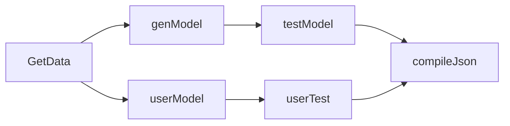

# Template Scenario

Scenario d'exemple qui sert de template pour les prochains.



## Requirements 

nextflow <= 20.10.0.5430

Pour lancer le scénario en local, il faut en plus avoir:
- jq
- curl 

Pour lancer le scénario avec Docker:
- docker <= 20.10.8
- l'image docker [uniq_actors](https://gitlab.inria.fr/lola/algorithmes/template-docker)

## How to use

```bash 
$ git clone https://gitlab.inria.fr/lola/scenarios/template-scenario
$ cd template-scenario 
```

Pour lancer le scénario en local:
```bash
$ nextflow run main.nf --lrsHost=http://garimpeiro12.loria.fr 
```

Pour lancer le scénario avec Docker:
```bash
$ nextflow -c nextflow_docker.config run main.nf --lrsHost=garimpeiro12.loria.fr
```

Pour lancer le scénario avec l'algorithme de l'utilisateur:
``` bash
$ nextflow -c nextflow_docker.config run main.nf --lrsHost=http://garimpeiro12.loria.fr --lrsPort=80 --user_algo=<PATH_TO_USER_MODULE>"

# An example exists in this repository
$ nextflow -c nextflow_docker.config run main.nf --lrsHost=http://garimpeiro12.loria.fr --lrsPort=80 --user_algo="/home/pnoel/Documents/lola/template-scenario/modules/user_algo.nf"
```

## Comment créer un scénario Nextflow compatible avec la plateforme Lola

Pour voir la documentation, suivre la [doc sur le wiki](https://gitlab.inria.fr/lola/scenarios/template-scenario/-/wikis/Acceuil-cr%C3%A9ation-de-sc%C3%A9nario-pour-Lola-avec-Nextflow)
