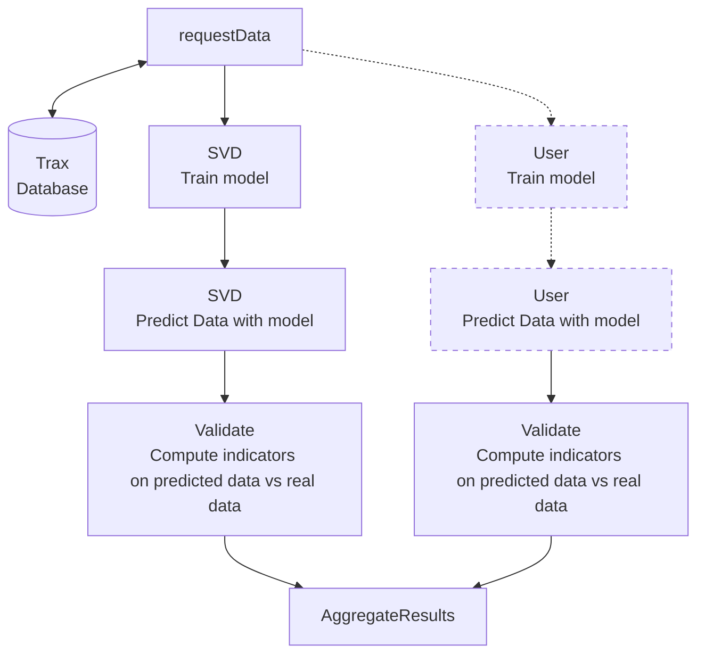

# Scenario recommandation



[[_TOC_]]

# Requirements:

- nextflow >= 21.04.1 (see [nextflow.io](https://www.nextflow.io/docs/latest/getstarted.html) for information)
- python >= 3.8
- python packages. Use `pip install -r requirements.txt` to install packages.
- [docker ](https://docs.docker.com/get-docker/)

# Project structure
The project is composed of the following directions: 

1. `bin/`: contains all the python scripts required for each processes, and files related to them. The Dockerfile is inside too.
   **Note**: If you use Nextflow without docker, add this path to your PATH env:  [How to add binaries to your Path (Linux, MacOS, Windows)](https://zwbetz.com/how-to-add-a-binary-to-your-path-on-macos-linux-windows/). 

2. `modules/`: Contains the nextflow scripts for the process definitions. Each process is defined by a file that describes how the process it works and a configuration file. To facilitate the task, both files (process decription and configuration file) have the same name but with diffetent extensions (.config and .nf)

3. `nextflow.config`: The configuration file in nextflow. It calls all the configuration files of the processes saved in the directory modules. 
To change the predefined parameters, this configuration file need to be edited. Or use parameters with the `CLI` interface when running nextflow (see [Pipeline parameters](https://www.nextflow.io/docs/latest/cli.html?highlight=parameter#cli-params))

4. `main.nf`: The entrypoint of the Nextflow workflow that describes all the workflow from retrieving data till calculating final results (indicators) and regrouping them in one single file. 

5. `templates/`: Contains template files used for the Lola-platform

# How to use

## Run the nextflow with program locally

If you want to run the workflow with Python scripts inside the `bin/` directory, follow the next steps:

- Install required dependencies:
  **Note**: Use a virtual-env or conda-env before running `pip` commands to avoid polluting your device with Python packages.
  ``` bash
  # activate your env before
  
  # installation of Python dependencies
  $ pip install -r bin/requirements.txt
  ```

- Add the scripts in your PATH ([How to add binaries to your Path (Linux, MacOS, Windows)](https://zwbetz.com/how-to-add-a-binary-to-your-path-on-macos-linux-windows/))
  On linux:
  ```bash
  $ export PATH=$PATH:$(realpath bin/)
  ```

- Run the workflow
  You have to be in the main directory and use the follwoing commands:
  ```bash
  $ nextflow run main.nf --lrsHost=http://garimpeiro12.loria.fr --lrsPort=81
  ```
  **Note**: If you want to use garimpeiro12 as LRS, you must be on the Inria VPN. In other cases, use you Trax LRS instance.

## Run the nextflow with docker

- Create the docker image by using the following command: 
  ``` bash
  $ cd bin/
  $ docker build -t recom:latest .
  ```
  **Note**: The image is available at the address `harbor.loria.fr/lola/recom:latest` (use the VPN)

- Create a config file to force nextflow to use Docker:
  ``` bash
  $ cat nextflow_docker.config
  docker {
       enabled = true
       runOptions = "--network=host"
   }
  ```

- Run the workflow with nextflow
  ``` bash
  $ nextflow -c nextflow_docker.config run main.nf --lrsHost=YourLocalLRS --lrsPort=80
  ```
